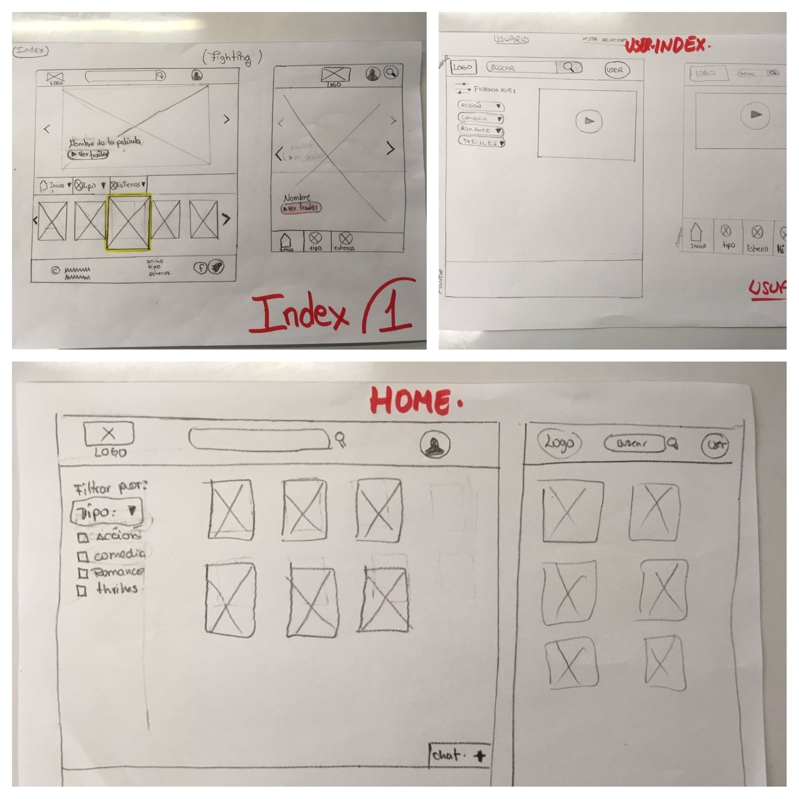
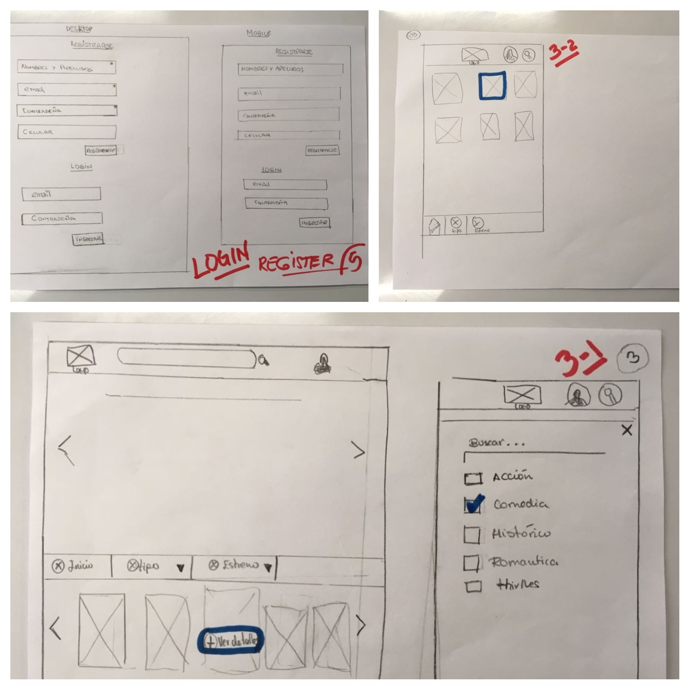
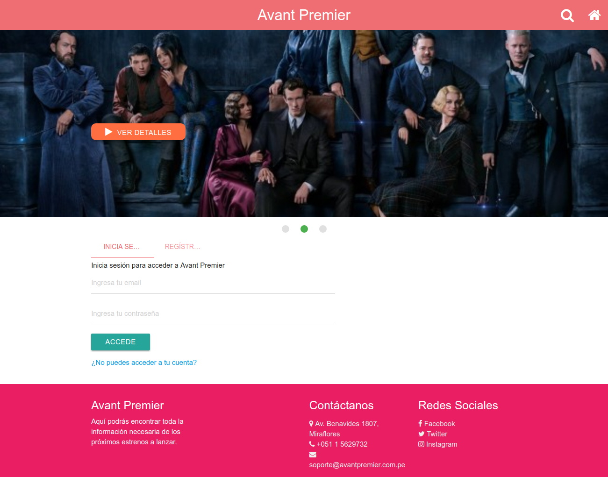
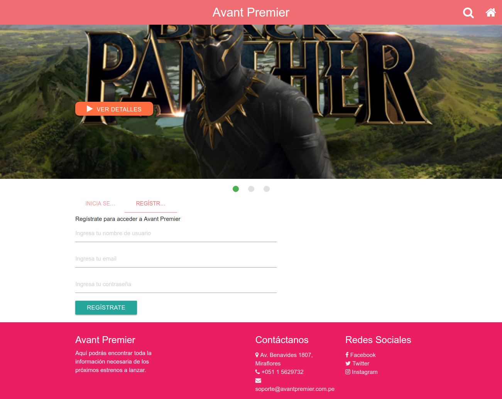
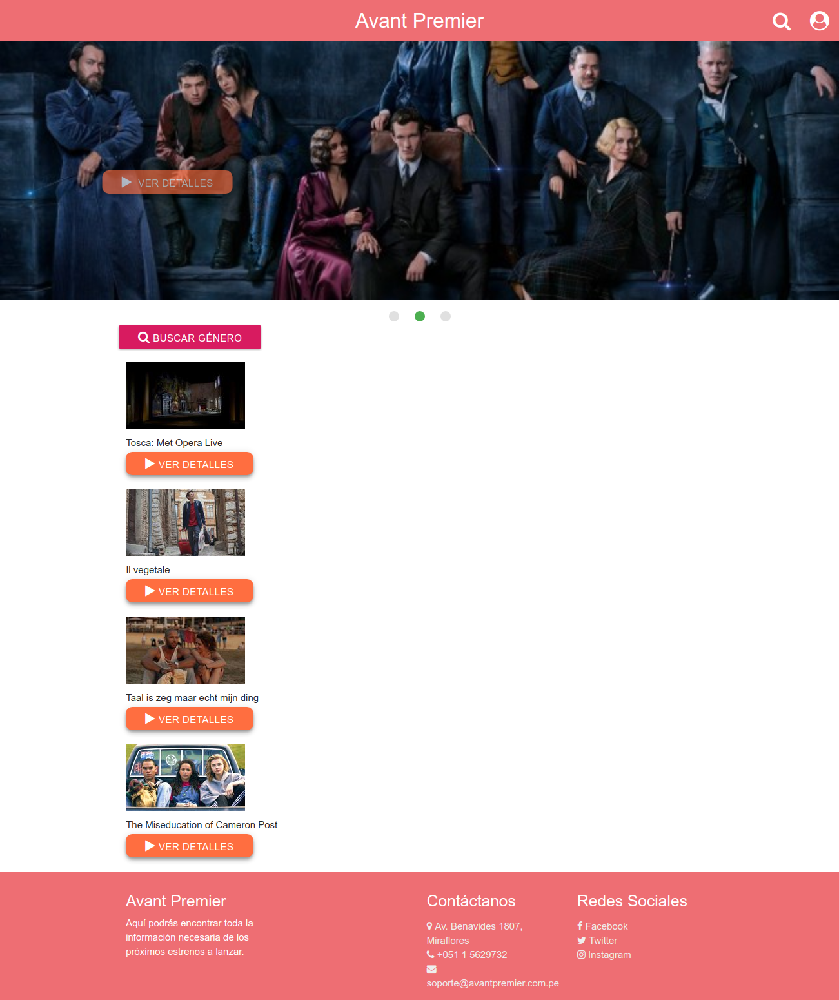
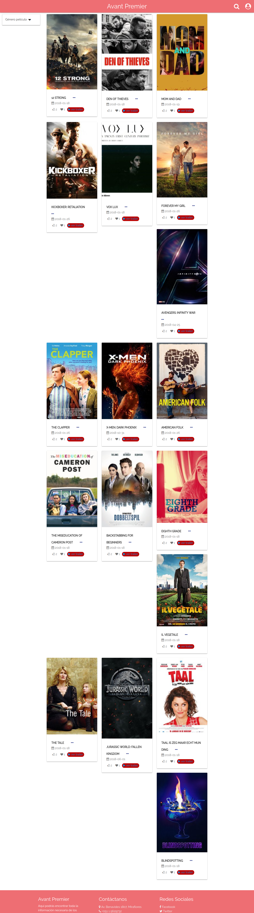

# Avant-Premier

Avant premier es un sitio web, donde encontrarás información de las películas en estreno.

## Desarrollado para 
[Laboratoria](http://laboratoria.la)

## 1. Objetivo:
> En base a la necesidad detectada en los usuarios, a quienes les interesaba saber sobre los próximos estrenos, se desarrolló una plataforma que permita ubicar las próximas peliculas a estrenar.

## 2. Descripción del proyecto:

#### ¿Qué es avant premier?
> Avant Premier es una website muy interactiva en la que podrás encontrar toda la información necesaria de los próximos estrenos a lanzar en las carteleras locales.

#### ¿Por qué solo muestran estrenos?
> En Avant Premier sabemos que nuestros usuarios siempre están pendientes de las novedades del cine y que no desean perderse ninguna película es por eso que aquí siempre podrán encontrar toda la información necesaria y que en ningún otro lugar encontraran.

## 3. Organización del proyecto:
>El equipo de desarrollo del proyecto Avant Premier ha venido trabajando para desarrollar este proyecto para ello nos hemos organizado de la siguiente manera:

## 3.1. Distribución de tareas

| Día 1                                            | Día 2                                                                  |
| ------------------------------------------------ |----------------------------------------------------------------------- |
| Definir la idea y detectar la necesidad.         | Culminar con el maquetado del website: vistas desktop y mobile | $1600 |
| Determinar los recursos tecnológicos a utilizar. | Pruebas de conexión e implementación del API                           |
| Investigación sobre el uso de la API a utilizar. | Funcionalidad login y register firebase                                |
| Diseño de prototipos y sketchs.                  |                                                                        |
| Maquetado de los prototipos.                     |                                                                        |

| Día 3                                            | Día 4                                                                  |
| ------------------------------------------------ |----------------------------------------------------------------------- |
| Funcionalidad del API y el website.              | Presentación del producto final.                                       |

## 3.2. Vistas y prototipos de pantallas

* Sketch prototipo de pantallas

* Vistas y diseños de prototipo de pantallas

## 4. Recursos utilizados
* HTML5
* CSS 3
* MATERIALIZE
* JQUERY v3.2.1.
* FIREBASE
* THE MOVIE DB

## 5. Integrantes
* Gessenia Canales
* Melyna Bisley.
* Lourdes Loayza.
