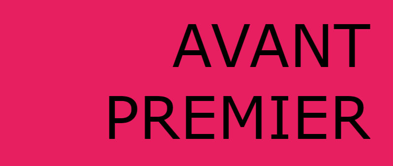

# HACKATON: AVANT-PREMIER

#### 1. Objetivo:
Desarrollar una plataforma que permita ubicar las próximas peliculas a estrenar.

#### 2. Descripción del proyecto:

#### ¿Qué es avant premier?
Avant Premier es una website muy interactiva en la que podrás encontrar toda la información necesaria de los próximos estrenos a lanzar en las carteleras locales.

#### ¿Por qué solo muestran estrenos?
En Avant Premier sabemos que nuestros usuarios siempre están pendientes de las novedades del cine y que no desean perderse ninguna película es por eso que aquí siempre podrán encontrar toda la información necesaria y que en ningún otro lugar encontraran.

#### 3. Organización del proyecto:

El equipo de desarrollo del proyecto Avant Premier ha venido trabajando para desarrollar este proyecto para ello nos hemos organizado de la siguiente manera:

#### Día 1 : 
- Horas: 9.30 am - 12.30 pm
Definir la idea y detectar la necesidad: Todas las personas a las que les gusta saber cuáles son los próximos estrenos.
Determinar los recursos tecnológicos a utilizar: Se decidió utilizar Materialize debido a la estructura de su diseño y paleta de colores.
Evaluar y determinar el rendimiento de la Api asignada: Si bien las instrucciones de la hackaton sugerian el uso de OMDb API se decidió utilizar The movie DB API por la documentación que ofrecia y el contendio extenso con el que cuenta dicha API.
Diseño de prototipos: Se hizo sketch de las pantallas a maquetar y se repartieron entre los usuarios las pantallas en las que cada uno haría el maquetado.

- Horas: Tarde - Noche 
Maquetado de los prototipos.
Investigación sobre el uso de la API seleccionada.

#### Día 2 :
- Horas: 9.30 am - 12.30 pm
Culminar con el maquetado de las vistas del website
Implementación del API

- Horas: Tarde - Noche 
Culminar con el maquetado de las vistas del website
Implementación del API

#### 3. Recursos utilizados
* HTML5
* CSS
* MATERIALIZE
* JQUERY v3.2.1.
* FIREBASE

#### 4. Integrantes
* Gessenia Canales
* Melyna Bisley.
* Lourdes Loayza.
